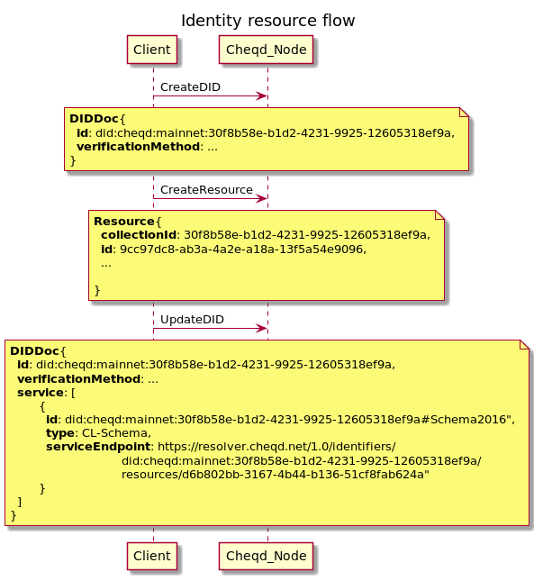

# ADR 008: cheqd DIDDoc resources

## Status

| Category                  | Status                                           |
| ------------------------- | ------------------------------------------------ |
| **Authors**               | Renata Toktar, Alexander Kolesov, Ankur Banerjee |
| **ADR Stage**             | DRAFT                                            |
| **Implementation Status** | Draft                                            |
| **Start Date**            | 2021-09-23                                       |

## Summary

This ADR will define how DID Resources can be created and represented through the use of a DID URL, which when dereferenced.
The identity entities and transactions for the cheqd network are designed to support [Verifiable Credentials](https://www.w3.org/TR/vc-data-model/) issuing.

## Context

[Verifiable Credentials](https://www.w3.org/TR/vc-data-model/) are digital entries that represent claims about its subjects and can be verified via digital proofs.
To issue and validate such a credential, you will need to save the following list of entities to the ledger:

* credential scheme,
* public keys,
* etc.

The design of this document began as an idea of storing these entities in a ledger, but has evolved to the ability to associate any type of resource with a DID Document. The resource can be `json`, `text`, `image`, or another type of object in byte representation.

## Decision

### Assumptions

* Immutability:
  * Resources are immutable, so can't be updated/removed;
* Limitations
  * Resource size is now limited by maximum tx/block size;

### Future improvements

* Limitations
  * Introduce module level resource size limit that can be changed by voting

### 'Resources' module on ledger

A new module will be created: `resource`.

### Dependencies

* It will have `cheqd` module as a dependency.
  * Will be used for DIDs existence checks.
  * Will be used for authentication

### DID Resource Creation Flow



### Types

#### Resource

* **Collection ID: UUID ➝** (did:cheqd:...:)**`UUID` (supplied client-side)**
* **ID: UUID ➝ specific to resource, also effectively a version number (supplied client-side)**
* **Name: String (e.g., `CL-Schema1` (supplied client-side)**
* **ResourceType (supplied client-side)** Possible values:
  * `CL-Schema`
  * `JSONSchema2020`
* **MimeType: (`application/json`/`image`/`application/octet-stream`/`text/plain`) (supplied client-side)** Possible values:
  * `application/json`
  * `application/octet-stream`
  * `text/plain`
  * `image/apng`
  * `image/avif`
  * `image/gif`
  * `image/jpeg`
  * `image/png`
  * `image/svg+xml`
  * `image/webp`
* **Data: Byte\[\] (supplied client-side)**
* Created: XMLDatetime (computed ledger-side)
* Checksum: SHA-256 (computed ledger-side)
* previousVersionId: `null` if first, otherwise ID as long as Name, ResourceType, and MimeType match previous version (computed ledger-side)
* nextVersionId: `null` if first/latest, otherwise ID as long as Name, ResourceType, and MimeType match previous version (computed ledger-side)

Example:

```jsonc
{
  "collectionId":      "zF7rhDBfUt9d1gJPjx7s1JXfUY7oVWkY",
  "id":                 "9cc97dc8-ab3a-4a2e-a18a-13f5a54e9096",
  "name":               "CL-Schema1",
  "resourceType":      "CL-Schema",
  "mimeType":          "application/json"
  "data":               <json string '{\"attrNames\":[\"last_name\",\"first_name\"]}` in bytes>,
  "created":            "2022-04-20T20:19:19Z",
  "checksum":           "a7c369ee9da8b25a2d6e93973fa8ca939b75abb6c39799d879a929ebea1adc0a",
  "previousVersionId: null,
  "nextVersionId:     null
}
```

<details>
<summary>ResourcePreview</summary>

#### ResourcePreview

* **Collection ID: UUID ➝** (did:cheqd:...:)**`UUID` (supplied client-side)**
* **ID: UUID ➝ specific to resource, also effectively a version number (supplied client-side)**
* **Name: String (e.g., `CL-Schema1` (supplied client-side)**
* **ResourceType (supplied client-side)** Possible values:
  * `CL-Schema`
  * `JSONSchema2020`
* **MimeType: (`application/json`/`image`/`application/octet-stream`/`text/plain`) (supplied client-side)** Possible values:
  * `application/json`
  * `application/octet-stream`
  * `text/plain`
  * `image/apng`
  * `image/avif`
  * `image/gif`
  * `image/jpeg`
  * `image/png`
  * `image/svg+xml`
  * `image/webp`
* Created: XMLDatetime (computed ledger-side)
* Checksum: SHA-256 (computed ledger-side)
* previousVersionId: `null` if first, otherwise ID as long as Name, ResourceType, and MimeType match previous version (computed ledger-side)
* nextVersionId: `null` if first/latest, otherwise ID as long as Name, ResourceType, and MimeType match previous version (computed ledger-side)

Example:

```jsonc
{
  "collectionId":      "zF7rhDBfUt9d1gJPjx7s1JXfUY7oVWkY",
  "id":                 "9cc97dc8-ab3a-4a2e-a18a-13f5a54e9096",
  "name":               "CL-Schema1",
  "resourceType":      "CL-Schema",
  "mimeType":          "application/json"
  "created":            "2022-04-20T20:19:19Z",
  "checksum":           "a7c369ee9da8b25a2d6e93973fa8ca939b75abb6c39799d879a929ebea1adc0a",
  "previousVersionId: null,
  "nextVersionId:     null
}
```

</details>

<details>
<summary>MsgCreateResource</summary>

#### MsgCreateResource

* **Collection ID: UUID ➝** (did:cheqd:...:)`<identifier>` (supplied client-side)** - a parent DIDDoc identifier from `id` field
* **ID: UUID ➝ specific to resource, also effectively a version number (supplied client-side)**
* **Name: String (e.g., `CL-Schema1` (supplied client-side)**
* **ResourceType (supplied client-side)** Possible values:
  * `CL-Schema`
  * `JSONSchema2020`
* **MimeType: (`application/json`/`image`/`application/octet-stream`/`text/plain`) (supplied client-side)** Possible values:
  * `application/json`
  * `application/octet-stream`
  * `text/plain`
  * `image/apng`
  * `image/avif`
  * `image/gif`
  * `image/jpeg`
  * `image/png`
  * `image/svg+xml`
  * `image/webp`
* **Data: Byte\[\] (supplied client-side)**

Example:

```jsonc
{
  "collectionId":  "zF7rhDBfUt9d1gJPjx7s1JXfUY7oVWkY",
  "id":             "9cc97dc8-ab3a-4a2e-a18a-13f5a54e9096",
  "name":           "CL-Schema1",
  "resourceType":  "CL-Schema",
  "mimeType":      "application/json"
  "data":           <json string '{\"attrNames\":[\"last_name\",\"first_name\"]}` in bytes>
}
```

</details>

<details>
<summary>MsgCreateResourceResponse</summary>

#### MsgCreateResourceResponse

* Resource: [Resource](#resource)

Example:

```jsonc
{ "resource":  <Resource> }
```

</details>

<details>
<summary>QueryGetCollectionResourcesRequest</summary>

#### QueryGetCollectionResourcesRequest

* Collection ID: String - an identifier of linked DIDDoc
  
Example:

```jsonc
{ "collectionId": "zF7rhDBfUt9d1gJPjx7s1JXfUY7oVWkY" }
```

</details>

<details>
<summary>QueryGetCollectionResourcesResponse</summary>

#### QueryGetCollectionResourcesResponse

* Resources: [ResourcePreview\[\]](#resourcepreview)

Example:

```jsonc
{ "resources":  [<ResourcePreview1>, <ResourcePreview2>] }
```

</details>

<details>
<summary>QueryGetResourceRequest</summary>

#### QueryGetResourceRequest

* Collection ID: String - an identifier of linked DIDDoc
* ID: String - unique resource id

Example:

```jsonc
{ 
  "collectionId": "zF7rhDBfUt9d1gJPjx7s1JXfUY7oVWkY",
  "id": "9cc97dc8-ab3a-4a2e-a18a-13f5a54e9096"
}
```

</details>

<details>
<summary>QueryGetResourceResponse</summary>

#### QueryGetResourceResponse

* Resource: [Resource](#resource)

Example:

```jsonc
{ "resource":  <Resource> }
```

</details>

<details>
<summary>QueryGetAllResourceVersionsRequest</summary>

#### QueryGetAllResourceVersionsRequest

* Collection ID: String - an identifier of linked DIDDoc
* Name: String
* ResourceType: String
* MimeType: String

Example:

```jsonc
{ 
  "collectionId":  "zF7rhDBfUt9d1gJPjx7s1JXfUY7oVWkY",
  "name":           "CL-Schema1",
  "resourceType":  "CL-Schema",
  "mimeType":      "application/json"
}
```

</details>

<details>
<summary>QueryGetAllResourceVersionsResponse</summary>

#### QueryGetAllResourceVersionsResponse

* Resources: [ResourcePreview\[\]](#resourcepreview)

Example:

```jsonc
{ "resources":  [<ResourcePreview1>, <ResourcePreview2>] }
```

</details>

### State

* `resources:<collection-id>:<resource-id>` ➝ **Resource**
  * `<collection-id>` is the last part of DID. It can be UUID, Indy-style or whatever is allowed by ledger. It allows us to evolve over time more easily.
  * `<resource-id>` is a unique resource identifier on UUID format

### Transactions

#### CreateResource

* Input:
  * [MsgCreateResource](#msgcreateresource)

* Output:
  * [MsgCreateResourceResponse](#msgcreateresourceresponse)

* Processing logic:
  * Check that associated DIDDoc exists;
  * Authenticate request the same way as DIDDoc creation and updating;
  * Validate properties;
  * Validate **data** for specific resource types (CL Schema);
  * Validate that **ID** is unique;
  * Set **created** date time;
  * Set `previousVersion` and `nextVersion` if this is a new version (a resource with the same name, type ans resource-type exists);
  * Compute **checksum**;
  * Persist the **resource** in state;

CLI Example:

```jsonc
cheqd-noded tx resource create-resource "{
                                          \"collectionId\":  \"zF7rhDBfUt9d1gJPjx7s1JXfUY7oVWkY\",
                                          \"id\":             \"9cc97dc8-ab3a-4a2e-a18a-13f5a54e9096\",
                                          \"name\":           \"CL-Schema1\",
                                          \"resourceType\":  \"CL-Schema\",
                                          \"mimeType\":      \"application/json\"
                                         }" file_with_resource.data\
                                          --private-key <private-identity-key-by-collection-

```

### Queries

#### GetCollectionResources

* Input:
  * [QueryGetCollectionResourcesRequest](#querygetcollectionresourcesrequest)

* Output:

  * [QueryGetCollectionResourcesResponse](#querygetcollectionresourcesresponse)

* Processing logic:

  * Retrieves the whole resource collection for the specified DID;
  * Returns only resources preview without `data` field;
  
#### GetResource

* Input:
  * [QueryGetResourceRequest](#querygetresourcerequest)

* Output:

  * [QueryGetResourceResponse](#querygetresourceresponse)

* Processing logic:
  * Retrieves a specific resource by Collection-ID and resource ID;

#### GetAllResourceVersions

* Input:
  * [QueryAllResourceVersionsRequest](#querygetallresourceversionsrequest)

* Output:
  * [QueryAllResourceVersionsResponse](#querygetallresourceversionsresponse)

* Processing logic:
  * Retrieves all resource versions by collection id, resource name, resource type and mime type;
  * Returns only resources preview without `data` field;
  
### DID Resolver

We need to support resource resolution in the DID resolver.

#### Resource resolution

* Input DIDUrl:
  * `https://resolver.cheqd.net/1.0/identifiers/<did>/resources/<resource-id>`

* Output:
  * JSON encoded [QueryGetResourceResponse](#querygetresourcerequest)

* Processing logic:
  * Simply call [GetResource](#getresource) via GRPC

### Linked DIDDoc

`CollectionId` field is an identifier of existing DIDDoc. There are no restrictions on the fields of this DIDDoc other than those described in [Cheqd DID Method ADR](adr-002-cheqd-did-method.md) and [W3C DID specification](https://www.w3.org/TR/did-core/). DIDDock must be located in the same ledger where the resource is created.
A list of resources related to DIDDoc can be found in its metadata:

```jsonc
QueryGetDidResponse {
  "did": {
    "id": "did:cheqd:mainnet:N22KY2Dyvmuu2PyyqSFKue",
    ...
  },
  "metadata": {
    "created": "2020-12-20T19:17:47Z",
    "updated": "2020-12-20T19:19:47Z",
    "deactivated": false,
    "versionId": "1B3B00849B4D50E8FCCF50193E35FD6CA5FD4686ED6AD8F847AC8C5E466CFD3E",
    "resources": [
      {
        "resourceURI":      "did:cheqd:mainnet:N22KY2Dyvmuu2PyyqSFKue/resources/9cc97dc8-ab3a-4a2e-a18a-13f5a54e9096",
        "resourceType":      "CL-Schema",
        "mimeType":          "application/json"
      }
    ]
  }
}
```

```jsonc
Resource {
  "collectionId":      "N22KY2Dyvmuu2PyyqSFKue",
  "id":                 "9cc97dc8-ab3a-4a2e-a18a-13f5a54e9096",
  "name":               "CL-Schema1",
  "resourceType":      "CL-Schema",
  "mimeType":          "application/json"
  "data":               <json string '{\"attrNames\":[\"last_name\",\"first_name\"]}` in bytes>,
  "created":            "2022-04-20T20:19:19Z",
  "checksum":           "a7c369ee9da8b25a2d6e93973fa8ca939b75abb6c39799d879a929ebea1adc0a",
  "previousVersionId: null,
  "nextVersionId:     null
}
```

### Resource versioning

Resource are immutable, but it is possible to create new versions of it under a new identifier(`id` field). When creating a resource whose fields `collectionId`, `name`, `resourceType`, `mimeType` match an existing resource:

* The latest version of the current resource will be added with a link to the new one. That is, field `nextVersionId` will contain the new resource identifier.
* A new resource with data from the transaction will be created with the previous version resource id in field `previousVersionId`.

Example:

Step 1. Resource exists in the ledger:

  ```jsonc
  Resource1
  {
    "collectionId":      "zF7rhDBfUt9d1gJPjx7s1JXfUY7oVWkY",
    "id":                 "9cc97dc8-ab3a-4a2e-a18a-13f5a54e9096",
    "name":               "CL-Schema1",
    "resourceType":      "CL-Schema",
    "mimeType":          "application/json"
    ...
    "previousVersionId: "12d5a5f6-e72d-11ec-8fea-0242ac120002",
    "nextVersionId:     null
  }
  ```

Step 2. Client send request for creating a new resource with a transaction MsgCreateResource

  ```jsonc
  MsgCreateResource for creating Resource2
  {
    "collectionId":  "zF7rhDBfUt9d1gJPjx7s1JXfUY7oVWkY",
    "id":             "f47e4790-1b4b-4186-8357-da6199665236",
    "name":           "CL-Schema1",
    "resourceType":  "CL-Schema",
    "mimeType":      "application/json"
    "data":           ...
  }
  ```

Step 3. After the transaction applying

```jsonc
Resource1
{
  "collectionId":      "zF7rhDBfUt9d1gJPjx7s1JXfUY7oVWkY",
  "id":                 "9cc97dc8-ab3a-4a2e-a18a-13f5a54e9096",
  "name":               "CL-Schema1",
  "resourceType":      "CL-Schema",
  "mimeType":          "application/json"
  ...
  "previousVersionId: "12d5a5f6-e72d-11ec-8fea-0242ac120002",
  "nextVersionId:     "f47e4790-1b4b-4186-8357-da6199665236"  // Resource2.id
}
```

```jsonc
Resource2
{
  "collectionId":      "zF7rhDBfUt9d1gJPjx7s1JXfUY7oVWkY",
  "id":                 "9cc97dc8-ab3a-4a2e-a18a-13f5a54e9096",
  "name":               "CL-Schema1",
  "resourceType":      "CL-Schema",
  "mimeType":          "application/json"
  ...
  "previousVersionId: "9cc97dc8-ab3a-4a2e-a18a-13f5a54e9096", // Resource1.id
  "nextVersionId:     null
}
```

## References

* [Hyperledger Indy](https://wiki.hyperledger.org/display/indy) official project background on Hyperledger Foundation wiki
  * [`indy-node`](https://github.com/hyperledger/indy-node) GitHub repository: Server-side blockchain node for Indy ([documentation](https://hyperledger-indy.readthedocs.io/projects/node/en/latest/index.html))
  * [`indy-plenum`](https://github.com/hyperledger/indy-plenum) GitHub repository: Plenum Byzantine Fault Tolerant consensus protocol; used by `indy-node` ([documentation](https://hyperledger-indy.readthedocs.io/projects/plenum/en/latest/index.html))
  * [Indy DID method](https://hyperledger.github.io/indy-did-method/) (`did:indy`)
  * [Indy identity-domain transactions](https://github.com/hyperledger/indy-node/blob/master/docs/source/transactions.md)
* [Hyperledger Aries](https://wiki.hyperledger.org/display/ARIES/Hyperledger+Aries) official project background on Hyperledger Foundation wiki
  * [`aries`](https://github.com/hyperledger/aries) GitHub repository: Provides links to implementations in various programming languages
  * [`aries-rfcs`](https://github.com/hyperledger/aries-rfcs) GitHub repository: Contains Requests for Comment (RFCs) that define the Aries protocol behaviour
* [W3C Decentralized Identifiers (DIDs)](https://www.w3.org/TR/did-core/) specification
  * [DID Core Specification Test Suite](https://w3c.github.io/did-test-suite/)
* [Verifiable Credentials](https://www.w3.org/TR/vc-data-model/) official specification
* [Cosmos blockchain framework](https://cosmos.network/) official project website
  * [`cosmos-sdk`](https://github.com/cosmos/cosmos-sdk) GitHub repository ([documentation](https://docs.cosmos.network/))
* [Sovrin Foundation](https://sovrin.org/)
  * [Sovrin Networks](https://sovrin.org/overview/)
  * [`libsovtoken`](https://github.com/sovrin-foundation/libsovtoken): Sovrin Network token library
  * [Sovrin Ledger token plugin](https://github.com/sovrin-foundation/token-plugin)
