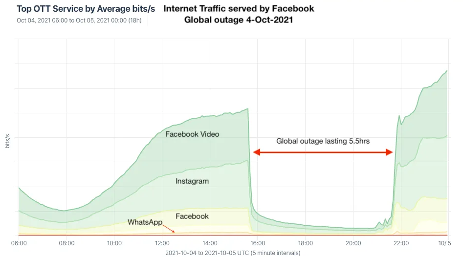
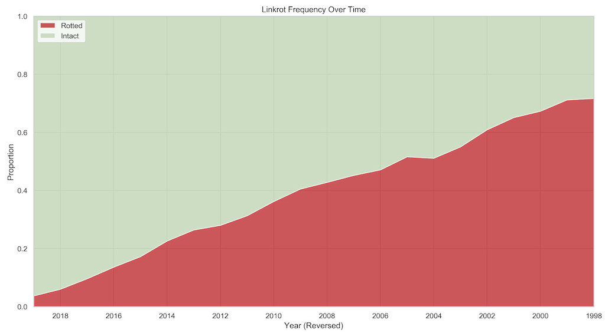
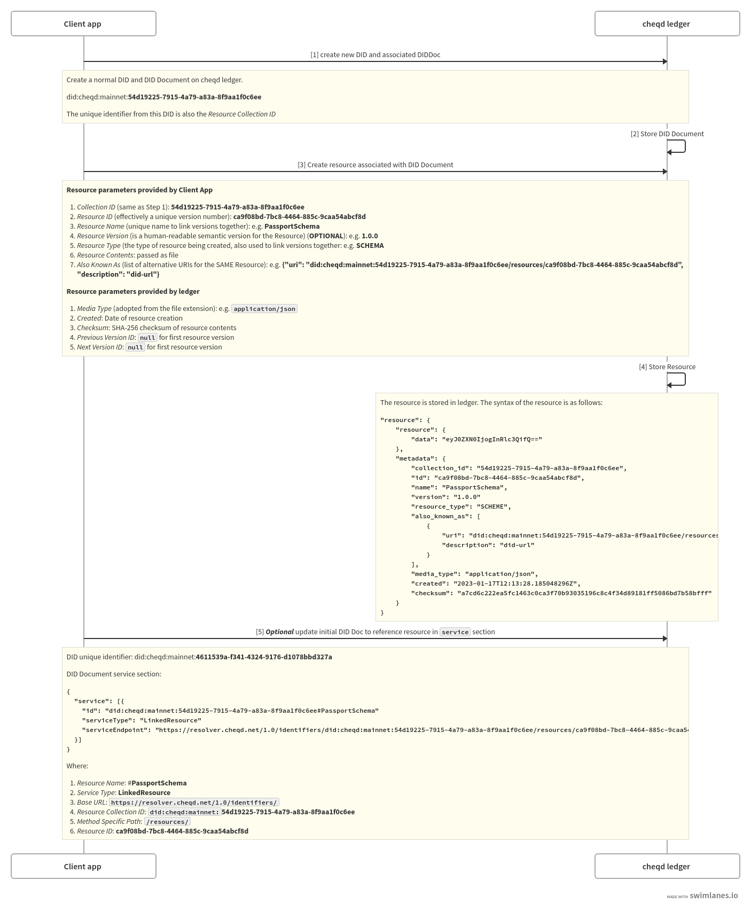
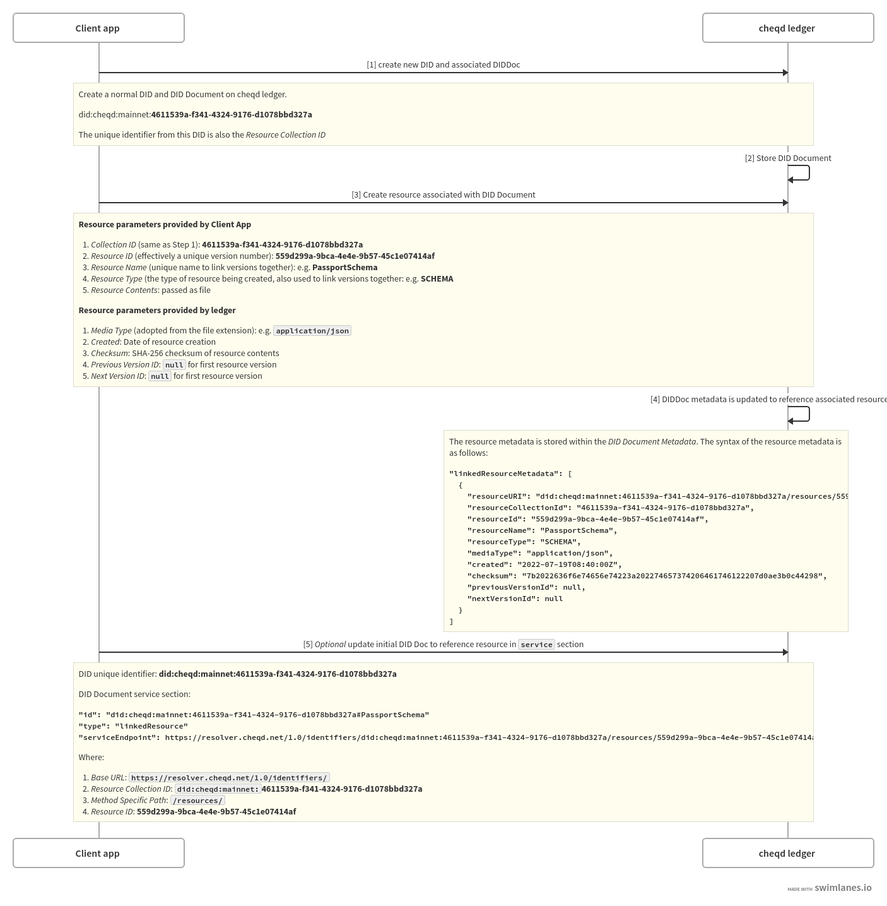

# ADR 008: On-ledger Resources with DID URLs

## Status

| Category | Status |
| :--- | :--- |
| **Authors** | Ankur Banerjee, Abdulla Ashurov, Alexandr Kolesov, Alex Tweeddale, Renata Toktar   |
| **ADR Stage** | ACCEPTED |
| **Implementation Status** | Implemented |
| **Start Date** | 2021-09-23 |
| **Last Updated** | 2023-01-19 |

## Summary

This ADR defines how on-ledger resources (e.g., text, JSON, images, etc) can be created and referenced using [a persistent and unique `did:cheqd` DID URL](adr-002-cheqd-did-method.md).

Each on-ledger resource will be linked with a DID Document, with create/update operations controlled using the specified verification methods in the associated DID Document.

## Context

### "Resources" in decentralised identity

[Trust over IP Foundation (ToIP)](https://trustoverip.org/) describes [how "resources" could be generically defined and accessed using DID URLs](https://wiki.trustoverip.org/display/HOME/DID+URL+Resource+Parameter+Specification). In a self-sovereign identity (SSI) ecosystem, such resources are often required in tandem with [W3C Verifiable Credentials](https://www.w3.org/TR/vc-data-model/), which is a standard way of representing portable digital credentials that represent claims about its subjects and can be verified via digital proofs.

Common types of resources that might be required to issue and validate Verifiable Credentials are:

* **Schemas**: Describe [the fields and content types in a credential](https://w3c.github.io/vc-data-model/#data-schemas) in a machine-readable format. Prominent examples of this include [Schema.org](https://schema.org/docs/schemas.html), [Hyperledger Indy `SCHEMA` objects](https://hyperledger-indy.readthedocs.io/projects/node/en/latest/transactions.html#schema), etc.
* **Revocation status lists**: Allow recipients of a Verifiable Credential exchange to [check the revocation status of a credential](https://w3c.github.io/vc-data-model/#validity-checks) for validity. Prominent examples of this include the [W3C `Status List 2021`](https://w3c-ccg.github.io/vc-status-list-2021/) specification, [W3C `Revocation List 2020`](https://w3c-ccg.github.io/vc-status-rl-2020/), [Hyperledger Indy revocation registries](https://hyperledger-indy.readthedocs.io/projects/sdk/en/latest/docs/concepts/revocation/cred-revocation.html), etc.
* **Visual representations for Verifiable Credentials**: Although Verifiable Credentials can be exchanged digitally, in practice most identity wallets want to present "human-friendly" representations. This allows the credential representation to be shown according to the brand guidelines of the issuer, [internationalisation ("i18n") translations](https://en.wikipedia.org/wiki/Internationalization_and_localization), etc. Examples of this include the [Overlays Capture Architecture (OCA) specification](https://oca.colossi.network/), [Apple Wallet PassKit](https://developer.apple.com/documentation/walletpasses) ("`.pkpass`"), [Google Wallet Pass](https://developers.google.com/wallet/generic), etc.


*Figure 1: Mobile boarding passes in Apple Wallet showing different visual styles (source: [British Airways media centre](https://mediacentre.britishairways.com/pressrelease/details/86/2016-72/6130))*

Such visual representations can also be used to quickly communicate information visually during identity exchanges, such as airline mobile boarding passes. In the [example above from British Airways](https://mediacentre.britishairways.com/pressrelease/details/86/2016-72/6130), the pass at the front is for a "Gold" loyalty status member, whereas the pass at the back is for a "standard" loyalty status member. This information can be represented in a Verifiable Credential, of course, but the example here uses the Apple Wallet / Google Wallet formats to overlay a richer, "human-friendly" display.

More broadly, there are other resources that might be relevant for issuers and verifiers in a self-sovereign identity exchange:

* **Documents related to SSI ecosystems**: [ToIP recommends making Governance Frameworks available through DID URLs](https://wiki.trustoverip.org/pages/viewpage.action?pageId=71241), which would typically be a text file, a [Markdown file](https://en.wikipedia.org/wiki/Markdown), PDF etc. This, for example, can enable parties building self-sovereign identity ecosystems to use DIDs to reference Governance Frameworks they conform to, at different levels of the technical stack.
* **Logos**: Issuers may want to provide authorised image logos to display in relation to their DID or Verifiable Credentials. Examples of this include [key-publishing sites like Keybase.io](https://keybase.io/cheqd_identity) (which is used by [Cosmos SDK block explorers such as our own](https://explorer.cheqd.io/validators) to show logos for validators) and "[favicons](https://en.wikipedia.org/wiki/Favicon)" (commonly used to set the logo for websites in browser tabs).

### Rationale for storing resources on-ledger

Decentralized Identifiers (DIDs) are often stored on ledgers (e.g., [cheqd](adr-002-cheqd-did-method.md), [Hyperledger Indy](https://hyperledger.github.io/indy-did-method/#:~:text=The%20DID%20Indy%20method%20specification,ledgers%20are%20W3C%20standard%20DIDs.), distributed storage (e.g., [IPFS](https://ipfs.io/) in [Sidetree](https://identity.foundation/sidetree/spec/)), or non-ledger distributed systems (e.g., [KERI](https://keri.one/)).

#### Drawbacks of hosting resources on traditional web endpoints

DIDs *can* be stored on traditional centralised-storage endpoints (e.g., [`did:web`](https://w3c-ccg.github.io/did-method-web/), [`did:git`](https://github.com/decentralized-identity/github-did)) but this comes with certain drawbacks:

1. **DIDs could be tampered by compromising the hosting provider**: DIDs and DID Documents ("DIDDocs") stored at a centralised web endpoint can be compromised and replaced by malicious actors.
2. **Hosting providers could unilaterally cease to host particular clients**: Hosting providers could terminate accounts due to factors such as non-payment of fees, violation of Terms of Service, etc.
3. **Single point-of-failure in resiliency**: Even for highly-trusted and sophisticated hosting providers who may not present a risk of infrastructure being compromised, a service outage at the hosting provider can make a DID anchored on their systems inaccessible.
   1. See [notable examples of service outages](https://totaluptime.com/notable-network-and-cloud-outages-of-2021/) from major cloud providers: [Amazon Web Services (AWS)](https://awsmaniac.com/aws-outages/), [Microsoft Azure](https://www.theregister.com/2018/09/17/azure_outage_report/), [Google Cloud](https://www.thousandeyes.com/blog/google-cloud-platform-outage-analysis), [Facebook / Meta](https://en.wikipedia.org/wiki/2021_Facebook_outage), [GitHub](https://github.blog/2022-03-23-an-update-on-recent-service-disruptions/), [Cloudflare](https://blog.cloudflare.com/cloudflare-outage-on-june-21-2022/)...
   

   *Figure 2: Graph showing drop in Facebook traffic from their global service outage in 2021 (source: [Kentik](https://www.kentik.com/blog/facebooks-historic-outage-explained/))*
   1. In particular, [the 2021 global Facebook outage](https://www.kentik.com/blog/facebooks-historic-outage-explained/) also [took down apps that used "Login with Facebook"](https://web.archive.org/web/20211005032128/https://www.wired.com/story/why-facebook-instagram-whatsapp-went-down-outage/) functionality. This highlights the risks of "contagion impact" (e.g., [a *different* Facebook outage took down Spotify, TikTok, Pinterest](https://www.engadget.com/facebook-sdk-spotify-tinder-tiktok-ios-outage-125806814.html)) of centralised digital systems - even ones run by extremely-capable tech providers.
4. **Link rot**: "Link rot" happens when over time, URLs become inaccessible, either because the endpoint where the content was stored is no longer active, or the URL format itself changes. The graph below from [an analysis by *The New York Times* of linkrot](https://www.cjr.org/analysis/linkrot-content-drift-new-york-times.php) shows degradation over time of URLs.
  

  *Figure 3: Linkrot analysis over 1996-2019 by New York Times (source: [Columbia Journalism Review / New York Times](https://www.cjr.org/analysis/linkrot-content-drift-new-york-times.php))*

#### Risks applicable in the context of Verifiable Credentials

The issues highlighted above **a material difference to the longevity of Verifiable Credentials**.

For example, a passport ([which typically have a 5-10 year validity](https://en.wikipedia.org/wiki/Passport_validity) issued as a Verifiable Credential anchored to a DID (regardless of whether the DID was on-ledger or not) might stop working if the credential schema, visual presentation format, or other necessary resources were stored off-ledger on traditional centralised storage.

Despite these issues, many self-sovereign identity (SSI) implementations - *even ones that use ledgers / distributed systems for DIDs* -  often utilise centralised storage. From the [W3C Verifiable Credential Implementation Guide](https://w3c.github.io/vc-imp-guide/#creating-new-credential-types):

> Example schema.org address with full URLs
>
> ```jsonc
> {
>   "@type": "http://schema.org/Person",
>   "http://schema.org/address": {
>     "@type": "http://schema.org/PostalAddress",
>     "http://schema.org/streetAddress": "123 Main St.",
>     "http://schema.org/addressLocality": "Blacksburg",
>     "http://schema.org/addressRegion": "VA",
>     "http://schema.org/postalCode": "24060",
>     "http://schema.org/addressCountry": "US"
>   }
> }
> ```

Using traditional web endpoints to store resources (such as schemas) that are critical for a Verifiable Credential to function undermines the benefits that persistently-accessible Decentralized Identifiers offer.

### Design principles

We took the following design principles into consideration, along with an explanation of how we addressed them:

1. **Built using existing, familiar DID Core Spec patterns**: Wherever possible, our design attempts to utilise existing patterns and behaviours within the W3C DID Core specification (such as the use of DID URLs to identify resources), instead of trying to implement proprietary/custom approaches. We believe that similar designs could be adopted by other DID methods if they choose.
2. **Protection against linkrot for long-term retrieval**: Any Resource stored on-ledger is replicated across multiple nodes.
   1. If any individual node or endpoint is down, lookup requests can be sent to any other node on the network.
   2. In a catastrophic scenario where the network itself stops to exist, e.g., companies shutting down, getting acquired etc the on-ledger data can still be restored by digital archivists using ledger snapshots. A practical example of this is how [Cosmos Hub makes historical chain archives available](https://github.com/cosmos/gaia/blob/main/docs/resources/archives.md) which can be restored. While this can be cumbersome, we wanted to design for this as a fail-safe.
3. **Extensible by default**: Our objective was to build a flexible design pattern that allowed developers to define and extend their own resource types. Trying to control what kinds of resources could be written to ledger would make the ledger-side logic complex. Instead, we opted for a design where the cheqd ledger acts agnostically to store resources, as long as correctly authorised, as a permanently-accessible endpoint.
4. **Design for DID-spec "dumb" as well as DID-spec "smart" client applications**: Many approaches in this space assume that client applications must be adept at parsing DIDDocs and resolving complex inter-DIDDoc relationships. We saw describing resources using DIDDocs as *metadata* about the resource which *could* be independently-parsed by "smart" client applications; while also providing a fallback approach for "dumb" client applications. We internally considered this as *"What if an identity wallet understood how to parse JSON, but didn't understand the DID Core spec?"*
5. **Version controlled**: The ability to evolve a resource over time is critical for identity use cases. As described above, examples of this include when identity document schemas change, logos evolve, etc. Current approaches (such as Hyperledger Indy CredDefs) deal with this by creating entirely new, unlinked resources. We designed to make it easy, using existing DID Core specification techniques, so that client applications could query *"What was the version of a resource with **this** name on **this** date/time?"*
6. **Make re-use of resources simple**: We liked the concept of [Schema.org](https://schema.org) in the sense that it promotes a common, machine-readable specification. Therefore, our design allows for patterns where the controllers of a DID can reference resources created by *other* DID owners/controllers, e.g., referencing a pre-existing schema. Taking this line of thought further, it allows for an arbitrary depth of how resources can be nested, as long as they are discoverable/resolvable.
7. **Not *all* types of resources should be stored on a ledger...but can be made discoverable through similar design patterns**: Distributed ledgers are great for redundancy, but the cost of this duplication (in terms of storage required by node, block size, transaction finality speeds, etc) can be quite significant. For instance, a distributed ledger is probably *not* the best storage and retrieval mechanism for a video file (which can run into many GBs/TBs); or even a PDF larger than a few MBs. cheqd network [restricts the block size for an individual block to ~200 KB](adr-005-genesis-parameters.md). This can be updated via an on-ledger vote, but the trade-off of asking node operators to provision ever-expanding storage would be not ideal. Our design therefore restricts the file/payload size of on-ledger resources (in our case, ~190 KB - giving enough room for transaction data besides the resource itself), while allowing the *same* techniques below to be used for describing off-ledger resources. E.g., [our first DID on cheqd network](https://blog.cheqd.io/a-new-hope-in-the-data-wars-our-first-ever-non-fungible-did-on-the-cheqd-network-7649cad8cb06) references [a 7+ MB image accessible via IPFS](https://gateway.ipfs.io/ipfs/bafybeihetj2ng3d74k7t754atv2s5dk76pcqtvxls6dntef3xa6rax25xe). We recognise and accept that DID owners/creators may choose to use their own centralised/decentralised storage, and the design patterns described below accommodate that.

## Resources on cheqd ledger

Resources on cheqd ledger are collated under *Resource Collections*, which are defined as a list of resources linked to and controlled using a DID Document ("DIDDoc").



*Figure 4: Overview of Resource and Resource Collection creation ([editable version](https://swimlanes.io/u/x2fQLlEM2))*

To create a new Resource, a client application first needs to create a DID (or use an existing not [deactivated](adr-002-cheqd-did-method.md#deactivate-did) DID) along with its associated DIDDoc. This *resource-linked DID* is the lowest, direct level of create/update/deactivate operation control that exists.

Individual Resources are uniquely identified by a common *Resource Name* and common *Resource Type* that MUST remain consistent across versions. The specific *version number* of a Resource is described using the *Resource ID*, which is a [Universally-Unique Identifier (UUID)](https://en.wikipedia.org/wiki/Universally_unique_identifier). Since UUIDs can be generated by *any* compatible software library, client applications are able to define this version number independent of the cheqd ledger. (This same technique and rationale is described in [ADR-002: cheqd DID method](adr-002-cheqd-did-method.md)).

This allows a *specific* Resource version to be referenced in a Verifiable Credential, as well as allowing client applications to query historical/updated Resource versions along with metadata that describes how the Resource evolved within a Resource Collection.

### *Optional* Discoverability via DIDDoc Services

Once a Resource has been created under a Resource Collection, the linked DIDDoc can be updated to provide a link to access it in the [service section](https://w3c.github.io/did-core/#services).

The rationale for linking to Resources in this manner, instead of creating a new top-level section, are as follows:

1. Client applications capable of doing [DID Resolution](https://w3c.github.io/did-core/#resolution) may have strong architectural assumptions to *only* expect the default DID Core specification sections in a response. We considered the possibility that such applications might (incorrectly) reject the entire DIDDoc as malformed, or crash in the process of trying to parse the DIDDoc.
2. On the other hand, [the *Service* section in a DIDDoc](https://w3c.github.io/did-core/#services) is designed to be flexible and extensible by design. New DID Service types can be registered through [DID Specification Registries](https://www.w3.org/TR/did-spec-registries/) by anyone. We suggest a new service type called *LinkedResource* should be used to reference any resource on cheqd within the service section. This is conceptually similar to the existing [*LinkedDomains*](https://www.w3.org/TR/did-spec-registries/#linkeddomains).
3. In practice, we noted that client applications capable of DID Resolution will gracefully fail/ignore unknown Service types. Client applications that *do* understand a particular Service type can continue parsing/resolving content they are designed to handle.
4. DIDDocs can reference other DIDDocs, such as when the [DID Controller](https://w3c.github.io/did-core/#did-controller) in one DIDDoc is specified as a [Verification Method](https://w3c.github.io/did-core/#verification-methods) in another DIDDoc. These links can be traversed using [DID URL dereferencing](https://w3c-ccg.github.io/did-resolution/#dereferencing).
5. Historical versions of Resources can always be accessed by traversing forwards/backwards in the Resource Collection by checking if a particular Service ID has old/new versions.
6. Multi-party control on Resource Collection updates is possible, since DIDs with multiple controllers specified in them *already* handle this scenario. In the normal process of updating a DIDDoc with multiple controllers, rules can be defined by client applications and/or the ledger on whether all controllers sign an update, or whether an *m-of-n* threshold needs to be applied. (Currently, the cheqd ledger requires all controllers to sign off on updates.)
7. Since the [cheqd ledger does not co-relate the on-ledger cheqd/Cosmos accounts to keys that control DIDDocs](adr-003-cli-tools.md), this provides another layer of access control by allowing DIDDoc controllers to rotate keys, if required.

  Example of referencing a resource using the *service* section:

```jsonc
  {
    "service": [{
      "id":"did:cheqd:testnet:DAzMQo4MDMxCjgwM#PassportSchema",
      "serviceType": "LinkedResource",
      "serviceEndpoint": "https://resolver.cheqd.net/1.0/identifiers/did:cheqd:testnet:DAzMQo4MDMxCjgwM/resources/bb2118f3-5e55-4510-b420-33ef9e1726d2"
    }]
  }
```

### Creating a new Resource within a Resource Collection

To create a new Resource, a client application first needs to create a DID (or use an existing [non-deactivated](adr-002-cheqd-did-method.md#deactivate-did) DID) along with its associated DIDDoc. This *resource-linked DID* is the lowest, direct level of create/update/deactivate operation control that exits.



*Figure 5: Detailed sequence diagram of Resource creation on cheqd ([editable version](https://swimlanes.io/u/dWCZzMbWb))*

Resources must be under the maximum block size restrictions to be able to fit into a transaction. Currently this is [estimated to be ~190 KB on cheqd mainnet, based on the ~200 KB block size limit](adr-005-genesis-parameters.md) plus additional headroom for metadata that needs to be described in the `ResourceHeader`.

#### Resource creation

Each request to create a Resource *must* provide the following parameters, supplied by the client application:

* `Resource Collection ID`: (did:cheqd:...:) (supplied client-side): unique identifier from DIDDoc.
* `Resource ID`: UUID ➝ specific to resource, also effectively a version number (supplied client-side)
* `Resource Name`: String (e.g., `CL-Schema1` (supplied client-side))
* `Resource Version`: String (OPTIONAL) ➝ is a human-readable semantic version for the Resource (e.g., `1.0.0` (supplied client-side))
* `Resource Type` (supplied client-side. It is recommended that new Resource Types are included in the [DID Spec Registries](https://www.w3.org/TR/did-spec-registries/))
* `Resource Contents`: passed as file or bytes data
* `Also Known As`: AlternativeUri array type ➝ is a list of URIs that can be used to get the resource

In addition to the above client-provided parameters, the ledger-side code will populate the following additional header fields (for properly-authenticated requests):

* `MediaType`: (e.g. `application/json`/`image`/`application/octet-stream`/`text/plain`) (computed ledger-side) This is based on the file extension of the associated resource file.
* `Created`: XMLDatetime (computed ledger-side)
* `Checksum`: SHA-256 (computed ledger-side)
* `previousVersionId`: an empty string if first, otherwise ID as long as Name, ResourceType, and MimeType match previous version (computed ledger-side)
* `nextVersionId`: an empty string if first/latest, otherwise ID as long as Name, ResourceType, and MimeType match previous version (computed ledger-side)

Example using the Veramo CLI:

```jsonc
{
    "kms": "local",
    "payload": { // example of resource header
        "collectionId": "DAzMQo4MDMxCjgwM",
        "id": "bb2118f3-5e55-4510-b420-33ef9e1726d2",
        "name": "PassportSchema",
        "resourceType": "CL-Schema",
        "data": "SGVsbG8sIHdvcmxk" // file with resource encoded into base64
    },
    "signInputs": [{
        "verificationMethodId": "did:cheqd:testnet:DAzMQo4MDMxCjgwM#key-1",
        "keyType": "Ed25519",
        "privateKeyHex": "0f5c124886178037952e87e0cdc55d185732577fca19ae877e64ac9ab24a0cc534e5326e70f1a42d785d93048aee806c359ec75a7b06f39253befd1746708438"
    }]
}
```

#### MsgCreateResource

* `collectionId`: (did:cheqd:...:)`<identifier>` (supplied client-side) ➝ unique identifier from DIDDoc.
* `id`: UUID representing resource ID ➝ specific to resource, also effectively a version number (supplied client-side)
* `name`: String (e.g., `CL-Schema1` (supplied client-side)
* `version`: String (**OPTIONAL**) ➝ a human-readable semantic version for the Resource (e.g., `1.0.0` (supplied client-side))
* `resourceType`: a string representing type of resource (supplied client-side). It is recommended that new Resource Types are included in the [DID Spec Registries](https://www.w3.org/TR/did-spec-registries/).
* `data`: Bytes representing a user data (supplied client-side)
* `alsoKnownAs` (supplied client-side) a list of alternative URIs for the SAME Resource
* `signInputs`: Signatures of the corresponding DID Document's controller(s) (supplied client-side).

Example:

```jsonc
{
    "Payload": {
        "data": "eyJhdHRyIjpbIm5hbWUiLCJhZ2UiXX0=",
        "collectionId": "91e5f0cf-5f1e-5c19-97d3-d313e84033b4",
        "id": "54cb8b4d-af33-4606-bc54-0f035ee30e0f",
        "name": "PassportScheme",
        "version": "1.0",
        "resourceType": "CL-Schema",
        "alsoKnownAs": [
            {
                "uri": "https://example.com/alternative-uri",
                "description": ""
            },
            {
                "uri": "https://example.com/alternative-uri",
                "description": "Alternative URI description"
            }
        ]
    },
    "SignInfo": [
        {
            "VerificationMethodID": "did:cheqd:testnet:91e5f0cf-5f1e-5c19-97d3-d313e84033b4#key-1",
            "Signature": "m0ZE4x5Qxs+6HEBoXDrjtGTLr9GuXjIttSznoVumRWIA3GMeDipXnCVgdZfa0PUVVdr2DQy9a0NyPXPeQcXdCw=="
        }
    ]
}
```

#### MsgCreateResourceResponse

* Returns created `Resource`.

Example:

```jsonc
{
    "resource": {
        "collection_id": "91e5f0cf-5f1e-5c19-97d3-d313e84033b4",
        "id": "54cb8b4d-af33-4606-bc54-0f035ee30e0f",
        "name": "PassportScheme",
        "version": "1.0",
        "resource_type": "CL-Schema",
        "also_known_as": [
            {
                "uri": "https://example.com/alternative-uri",
                "description": ""
            },
            {
                "uri": "https://example.com/alternative-uri",
                "description": "Alternative URI description"
            }
        ]
    }
}
```

#### QueryCollectionResourcesRequest

* `Collection ID`: String - an identifier of linked DIDDoc.
  
Example:

```jsonc
{ "collectionId": "91e5f0cf-5f1e-5c19-97d3-d313e84033b4" }
```

#### QueryCollectionResourcesResponse

* Returns `collection of resources` created by the specific `collection ID`.

Example:

```jsonc
{
    "resources": [
        {
            "collection_id": "91e5f0cf-5f1e-5c19-97d3-d313e84033b4",
            "id": "54cb8b4d-af33-4606-bc54-0f035ee30e0f",
            "name": "TicketScheme",
            "version": "1.0",
            "resource_type": "CL-Schema",
            "also_known_as": [
                {
                    "uri": "https://example.com/alternative-uri",
                    "description": ""
                }
            ],
            "media_type": "application/json",
            "created": "2023-01-21T20:02:55.664985039Z",
            "checksum": "a7cd6c222ea5fc1463c0ca3f70b93035196c8c4f34d89181ff5086bd7b58bfff",
            "previous_version_id": "",
            "next_version_id": ""
        },
        {
            "collection_id": "91e5f0cf-5f1e-5c19-97d3-d313e84033b4",
            "id": "54cb8b4d-af33-4606-bc54-0f035ee30e0f",
            "name": "PassportScheme",
            "version": "1.0",
            "resource_type": "CL-Schema",
            "also_known_as": [
                {
                    "uri": "https://example.com/alternative-uri",
                    "description": ""
                },
                {
                    "uri": "https://example.com/alternative-uri",
                    "description": "Alternative URI description"
                }
            ],
            "media_type": "application/json",
            "created": "2023-01-21T20:02:55.664985039Z",
            "checksum": "a7cd6c222ea5fc1463c0ca3f70b93035196c8c4f34d89181ff5086bd7b58bfff",
            "previous_version_id": "",
            "next_version_id": ""
        }
    ]
}
```

#### QueryResourceRequest

* `Collection ID`: String - an identifier of linked DIDDoc
* `ID`: String - unique resource id

Example:

```jsonc
{ 
  "collectionId": "91e5f0cf-5f1e-5c19-97d3-d313e84033b4",
  "id": "54cb8b4d-af33-4606-bc54-0f035ee30e0f"
}
```

#### QueryResourceResponse

* Returns `Resource` with a given `collection ID` and `ID`.

Example:

```jsonc
{
    "resource": {
        "resource": {
            "data": "eyJ0ZXN0IjogInRlc3QifQ=="
        },
        "metadata": {
            "collection_id": "91e5f0cf-5f1e-5c19-97d3-d313e84033b4",
            "id": "54cb8b4d-af33-4606-bc54-0f035ee30e0f",
            "name": "PassportScheme",
            "version": "1.0",
            "resource_type": "CL-Schema",
            "also_known_as": [
                {
                    "uri": "https://example.com/alternative-uri",
                    "description": ""
                },
                {
                    "uri": "https://example.com/alternative-uri",
                    "description": "Alternative URI description"
                }
            ],
            "media_type": "application/json",
            "created": "2023-01-21T20:02:55.664985039Z",
            "checksum": "a7cd6c222ea5fc1463c0ca3f70b93035196c8c4f34d89181ff5086bd7b58bfff",
            "previous_version_id": "",
            "next_version_id": ""
        }
    }
}
```

#### QueryResourceMetadataRequest

* `Collection ID`: String - an identifier of linked DIDDoc
* `ID`: String - unique resource id

Example:

```jsonc
{ 
  "collectionId": "91e5f0cf-5f1e-5c19-97d3-d313e84033b4",
  "id": "54cb8b4d-af33-4606-bc54-0f035ee30e0f"
}
```

#### QueryResourceMetadataResponse

Returns `resource's metadata` with a given `collection ID` and `ID`.

```jsonc
{
    "resource": {
        "collection_id": "91e5f0cf-5f1e-5c19-97d3-d313e84033b4",
        "id": "54cb8b4d-af33-4606-bc54-0f035ee30e0f",
        "name": "PassportScheme",
        "version": "1.0",
        "resource_type": "CL-Schema",
        "also_known_as": [
            {
                "uri": "https://example.com/alternative-uri",
                "description": ""
            },
            {
                "uri": "https://example.com/alternative-uri",
                "description": "Alternative URI description"
            }
        ],
        "media_type": "application/json",
        "created": "2023-01-21T20:02:55.664985039Z",
        "checksum": "a7cd6c222ea5fc1463c0ca3f70b93035196c8c4f34d89181ff5086bd7b58bfff",
        "previous_version_id": "",
        "next_version_id": ""
    }
}
```

### State

#### Metadata

* `resources-metadata:<collection-id>:<resource-id>` ➝ **Metadata**
  * `<collection-id>` is the last part of DID. It can be UUID, Indy-style or whatever is allowed by ledger. It allows us to evolve over time more easily.
  * `<resource-id>` is a unique resource identifier on UUID format

#### Data

* `resources-data:<collection-id>:<resource-id>` ➝ **Data**
  * `<collection-id>` is the last part of DID. It can be UUID, Indy-style or whatever is allowed by ledger. It allows us to evolve over time more easily.
  * `<resource-id>` is a unique resource identifier on UUID format

### Transactions

#### CreateResource

* Input:
  * [MsgCreateResource](#msgcreateresource)

* Output:
  * [MsgCreateResourceResponse](#msgcreateresourceresponse)

* Processing logic:
  * Check that associated DIDDoc exists;
  * Authenticate request the same way as DIDDoc creation and updating;
  * Validate properties;
  * Validate that **ID** is unique;
  * Set **created** date time;
  * Set `previousVersion` and `nextVersion` if this is a new version (a resource with the same collection-id, resource-name and resource-type exists);
  * Compute **checksum**;
  * Persist the **resource** in state;

cheqd Cosmos CLI Example:

```bash
cheqd-noded tx resource create [payload-file] [resource-data-file]
```

* `payload-file`: path to the payload file:

```jsonc
{
    "Payload": {
        "collectionId": "91e5f0cf-5f1e-5c19-97d3-d313e84033b4",
        "id": "54cb8b4d-af33-4606-bc54-0f035ee30e0f",
        "name": "PassportScheme",
        "version": "1.0",
        "resourceType": "CL-Schema",
        "alsoKnownAs": [
            {
                "uri": "https://example.com/alternative-uri",
                "description": ""
            },
            {
                "uri": "https://example.com/alternative-uri",
                "description": "Alternative URI description"
            }
        ]
    },
    "SignInputs": [
        {
            "VerificationMethodID": "did:cheqd:testnet:91e5f0cf-5f1e-5c19-97d3-d313e84033b4#key-1",
            "PrivKey": "tBjxEJCqSkj7u+iTWRqAVZwtcl2XBZrlaMfhxYIRc4wj7epbmDkJ35sCin3MWnAxvHJNDY0yyPafVspsrgb1Ng=="
        }
    ]
}
```

* `resource-data-file`: path to the resource file (e.g.: `/path/to/resource.jpeg`)

### Queries

#### GetCollectionResources

* Input:
  * [QueryCollectionResourcesRequest](#querycollectionresourcesrequest)

* Output:

  * [QueryCollectionResourcesResponse](#querycollectionresourcesresponse)

* Processing logic:

  * Retrieves the whole resource collection for the specified DID;
  * Returns only resource headers (without `data` field);

cheqd Cosmos CLI Example:

```bash
cheqd-noded query resource collection-metadata [collection-id]
```
  
#### GetResource

* Input:
  * [QueryResourceRequest](#queryresourcerequest)

* Output:

  * [QueryResourceResponse](#queryresourceresponse)

* Processing logic:
  * Retrieves a specific resource by Collection-ID and resource ID;

cheqd Cosmos CLI Example:

```bash
cheqd-noded query resource specific-resource [collectionId] [id]
```

#### QueryResourceMetadata

* Input:
  * [QueryResourceMetadataRequest](#queryresourcemetadatarequest)

* Output:
  * [QueryResourceMetadataResponse](#queryresourcemetadataresponse)

* Processing logic:
  * Retrieves all resource versions by collection id, resource id
  * Returns a resource's metadata from a collection with a given collection_id and id

cheqd Cosmos CLI Example:

```bash
cheqd-noded query resource resource-metadata [collectionId] [id]
```

### Resource versioning

Resource are immutable, but it is possible to create new versions of it under a new identifier(`id` field). When creating a resource whose fields `collection_id`, `name` and `resource_type` match an existing resource:

* The latest version of the current resource will be added with a link to the new one. That is, field `next_version_id` will contain the new resource identifier.
* A new resource with data from the transaction will be created with the previous version resource id in field `previousVersionId`.

Example:

Step 1. Resource exists in the ledger:

```jsonc
{
  "resource": {
    "collection_id": "91e5f0cf-5f1e-5c19-97d3-d313e84033b4",  // Common collection ID
    "id": "54cb8b4d-af33-4606-bc54-0f035ee30e0f", // Old Resource ID and version number
    "name": "PassportScheme", // Resource name must remain the same
    "version": "1.0", // Resource version
    "resource_type": "CL-Schema", // Resource type must remain the same
    "also_known_as": [
        {
            "uri": "https://example.com/alternative-uri",
            "description": ""
        },
        {
            "uri": "https://example.com/alternative-uri",
            "description": "Alternative URI description"
        }
    ],
    "media_type": "application/json",
    "created": "2022-07-19T08:40:00Z",
    "checksum": "7b2022636f6e74656e74223a202274657374206461746122207d0ae3b0c44298", // Old version checksum
    "previous_version_id": "", // an empty string, since no previous version
    "next_version_id": "" // an empty string, since no next version
  }
}

  ```

Step 2. Client send request for creating a new resource with a transaction MsgCreateResource

  ```jsonc
  MsgCreateResource for creating Resource2
  {
    "collectionId":   "91e5f0cf-5f1e-5c19-97d3-d313e84033b4", // same collection ID
    "id":             "bb2118f3-5e55-4510-b420-33ef9e1726d2", // new unique ID
    "name":           "PassportSchema", // same resource name
    "resourceType":   "CL-Schema", // same resource type
    
    "data":           ...
  }
  ```

Step 3. After the transaction applying

```jsonc
"resources": [
  { // First version of a Resource called PassportSchema
    "collection_id": "91e5f0cf-5f1e-5c19-97d3-d313e84033b4",  // Common collection ID
    "id": "54cb8b4d-af33-4606-bc54-0f035ee30e0f", // Old Resource ID and version number
    "name": "PassportScheme", // Resource name must remain the same
    "version": "1.0", // Resource version
    "resource_type": "CL-Schema", // Resource type must remain the same
    "also_known_as": [
        {
            "uri": "https://example.com/alternative-uri",
            "description": ""
        },
        {
            "uri": "https://example.com/alternative-uri",
            "description": "Alternative URI description"
        }
    ],
    "media_type": "application/json",
    "created": "2022-07-19T08:40:00Z",
    "checksum": "7b2022636f6e74656e74223a202274657374206461746122207d0ae3b0c44298", // Old version checksum
    "previous_version_id": "", // an empty string, since no previous version
    "next_version_id": "bb2118f3-5e55-4510-b420-33ef9e1726d2", // Points to next version below
  },
  { // Second version of a Resource called PassportSchema
    "collection_id": "91e5f0cf-5f1e-5c19-97d3-d313e84033b4", // Common collection ID
    "id": "bb2118f3-5e55-4510-b420-33ef9e1726d2", // New Resource ID and version number
    "name": "PassportScheme", // Resource name must remain the same
    "version": "1.0", // Resource version
    "resource_type": "CL-Schema", // Resource type must remain the same
    "also_known_as": [
        {
            "uri": "https://example.com/alternative-uri",
            "description": ""
        },
        {
            "uri": "https://example.com/alternative-uri",
            "description": "Alternative URI description"
        }
    ],
    "media_type": "application/json",
    "created": "2022-07-19T08:40:00Z",
    "checksum": "7b2022636f6e74656e74223a202274657374206461746122207d0ae3b0c44298", // Old version checksum
    "previous_version_id": "54cb8b4d-af33-4606-bc54-0f035ee30e0f", // Points to previous version above
    "next_version_id": "" // an empty string, since no next version
  }
]
```

## Decision

### Assumptions

* Immutability:
  * Resources are immutable, so can't be updated/removed;
* Limitations
  * Resource size is now limited by maximum tx/block size;

### Future improvements

* Limitations
  * Introduce module level resource size limit that can be changed by voting

### Resources module on ledger

A new module will be created: `resource`.

### Dependencies

* It will have `cheqd` module as a dependency.
  * Will be used for DIDs existence checks.
  * Will be used for authentication

## References

* [W3C Decentralized Identifiers (DIDs)](https://www.w3.org/TR/did-core/) specification
  * [DID Core Specification Test Suite](https://w3c.github.io/did-test-suite/)
* [W3C Verifiable Credentials](https://www.w3.org/TR/vc-data-model/) official specification
* [Cosmos blockchain framework](https://cosmos.network/) official project website
  * [`cosmos-sdk`](https://github.com/cosmos/cosmos-sdk) GitHub repository ([documentation](https://docs.cosmos.network/))
* [Hyperledger Indy](https://wiki.hyperledger.org/display/indy) official project background on Hyperledger Foundation wiki
  * [`indy-node`](https://github.com/hyperledger/indy-node) GitHub repository: Server-side blockchain node for Indy ([documentation](https://hyperledger-indy.readthedocs.io/projects/node/en/latest/index.html))
  * [`indy-plenum`](https://github.com/hyperledger/indy-plenum) GitHub repository: Plenum Byzantine Fault Tolerant consensus protocol; used by `indy-node` ([documentation](https://hyperledger-indy.readthedocs.io/projects/plenum/en/latest/index.html))
  * [Indy DID method](https://hyperledger.github.io/indy-did-method/) (`did:indy`)
  * [Indy identity-domain transactions](https://github.com/hyperledger/indy-node/blob/master/docs/source/transactions.md)
* [Hyperledger Aries](https://wiki.hyperledger.org/display/ARIES/Hyperledger+Aries) official project background on Hyperledger Foundation wiki
  * [`aries`](https://github.com/hyperledger/aries) GitHub repository: Provides links to implementations in various programming languages
  * [`aries-rfcs`](https://github.com/hyperledger/aries-rfcs) GitHub repository: Contains Requests for Comment (RFCs) that define the Aries protocol behaviour.
  