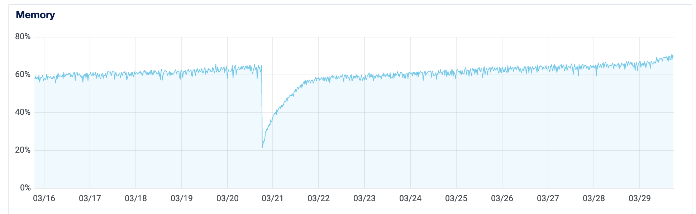
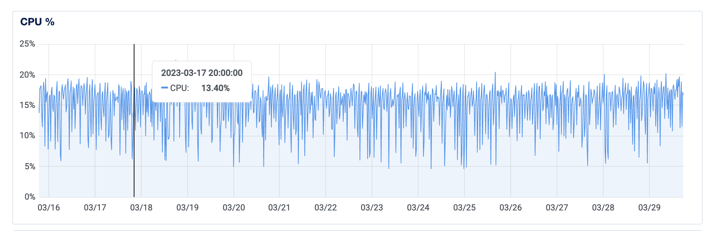
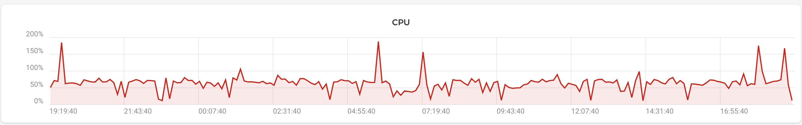
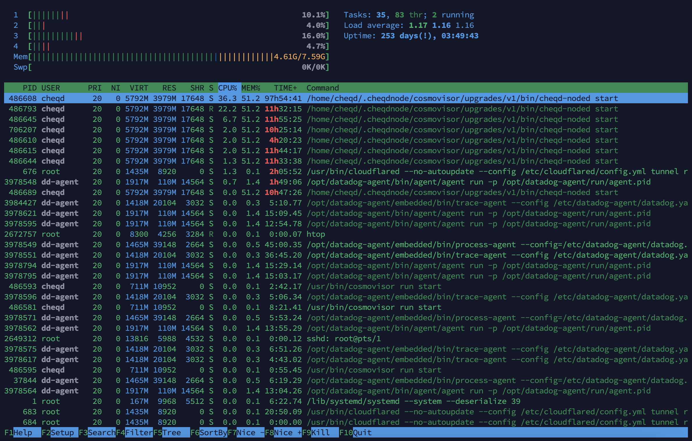

# Consistently high CPU/memory loads

## Context

Blockchain applications (especially when running validator nodes) are a-typical from "traditional" web server applications because their performance characteristics tend to be different in the way specified below:

1. **Tend to be more disk I/O heavy**: Traditional web apps will typically offload data storage to persistent stores such as a database. In case of a blockchain/validator node, the database *is* on the machine itself, rather than offloaded to separate machine with a standalone engine. Many blockchains use [LevelDB](https://github.com/google/leveldb) for their local data copies. (In Cosmos SDK apps, such as cheqd, this is the [Golang implementation of LevelDB](https://github.com/syndtr/goleveldb), but can also be [C-implementation of LevelDB](https://docs.tendermint.com/v0.34/introduction/install.html), [RocksDB](https://rocksdb.org/), etc.) The net result is the same as if you were trying to run a database engine on a machine: the system needs to have fast read/write performance characteristics.
2. **Validator nodes cannot *easily* be auto-scaled**: Many traditional applications can be *horizontally* (i.e., add more machines) or *vertically* (i.e., make current machine beefier) scaled. While this is *possible* for validator nodes, it must be done with extreme caution to ensure there aren't two instances of the same validator active simultaneously. This can be perceived by network consensus as a sign of compromised validator keys and lead to the [node being jailed for double-signing blocks](unjail.md). These concerns are less relevant for non-validating nodes, since they have a greater tolerance for missed blocks and *can* be scaled horizontally/vertically.
3. **Docker/Kubernetes setups are not recommended for validators** (unless you *really* know what you're doing): Primarily due to the double-signing risk, it's (../setup-and-configure/docker.md) unless you have a strong DevOps practice. The other reason is related to the first point, i.e., a Docker setup adds an abstraction layer between the actual underlying file-storage vs the Docker volume engine. Depending on the Docker (or similar abstraction) storage drivers used, you may need to [tune the storage/volume engine options](https://docs.docker.com/storage/storagedriver/select-storage-driver/) for optimal performance.

## Diagnosing a CPU/memory leak

> ⚠️ Please ensure you are running the [latest stable release of cheqd-node](https://github.com/cheqd/cheqd-node/releases/latest) since they may contain fixes/patches that improve node performance.

### What does a CPU/memory leak look like?

If you've got monitoring built in for your machine, a memory (RAM) leak would look like a graph where memory usage grows to 100%, falls off a cliff, grows to 100% again (the process repeats itself).

**Normal memory usage** may grow over time, but will not max out the available memory up to 100%. The graph below is taken from a server run by the cheqd team, over a 14-day period:



*Figure 1: Graph showing **normal** memory usage on a cheqd-node server*

### What does a CPU leak look like?

A "CPU leak", i.e., where one or more process(es) consume increasing amounts of CPU is rarer, but could also happen if your machine has too few vCPUs and/or underpowered CPUs.



*Figure 2: Graph showing **normal** CPU usage on a cheqd-node server*

**There's a catch here: depending on your monitoring tool, "100% CPU" could be measured differently!** The graph above is from [DigitalOcean's monitoring tools, which counts the sum of all CPU capacity as "100%"](https://www.digitalocean.com/community/tutorials/how-to-monitor-cpu-use-on-digitalocean-droplets).

Other monitoring tools, such as [Hetzner Cloud's](https://hetzner.cloud/?ref=tODNsVrSDe7m), count each CPU as "100%", thus making the overall figure displayed in the graph (shown below) add up to *number of CPUs x 100%*.



*Figure 4: Graph showing CPU usage on Hetzner cloud, adding up to* more than *100%*

Check what accounting metric your monitoring tool uses to get a realistic idea of whether your CPU is overloaded or not.

[*Load average* is another useful measure of the *responsiveness* of a machine](https://www.digitalocean.com/community/tutorials/load-average-in-linux), regardless of the CPU usage.

### Determining CPU/memory usage with command-line tools

If you don't have a monitoring application installed, you could use the built-in `top` or `htop` command.



*Figure 2: Output of `htop` showing CPU and memory usage*

`htop` is visually easier to understand than `top` since it breaks down usage *per*-CPU, as well as memory usage.

Unfortunately, this only provides the **real-time** usage, rather than historical usage over time. Historical usage typically requires an external application, which many cloud providers provide, or through 3rd party monitoring tools such as [Datadog](https://www.datadoghq.com/), etc.

[Tendermint / Cosmos SDK also provides a Prometheus metrics interface](https://docs.tendermint.com/v0.34/tendermint-core/metrics.html), in case you already have a Prometheus instance you can use or comfortable with using the software. This can allow alerting based on actual metrics emitted by the node, rather than just top-level system metrics which are a blunt instrument / don't go into detail.

## Troubleshooting system clock synchronisation issues

If your [system clock is out of synchronisation](https://linuxconfig.org/system-clock-vs-hardware-clock-on-linux), this could cause **Tendermint peer-to-peer connections to be rejected**. This is similar to [how SSL/TLS connections can get rejected with a "handshake error"](https://security.stackexchange.com/q/24704/3139) in a normal browser when accessing secure (HTTPS) sites.

The net result of your system clock being out of sync is that your node:

- *Constantly* tries to dial peers to try and fetch new blocks
- Connection gets rejected by some/all of them
- Keeps retrying the above until CPU/memory get exhausted, or the node process crashes

To check if your system clock is synchronised, use the following command (*note: only copy the command, not the sample output*):

```bash
root@hostname ~# timedatectl status
   Local time: Wed 2023-03-29 20:31:56 CEST
   Universal time: Wed 2023-03-29 18:31:56 UTC 
   RTC time: Wed 2023-03-29 18:31:57     
   Time zone: Europe/Berlin (CEST, +0200) 
   System clock synchronized: yes                         
   NTP service: active                      
   RTC in local TZ: no 
```

The timezone your machine is based in doesn't matter. You should check whether it reports `System clock synchronized: yes` and `NTP service: active`.

### Resolving system clock issues

If either of these are not true, chances are that your system clock has fallen out of sync, and *may* be the root cause of CPU/memory leaks. Follow [this guide on setting time synchronisation in Ubuntu](https://www.digitalocean.com/community/tutorials/how-to-set-up-time-synchronization-on-ubuntu-20-04) to resolve the issue, and then monitor whether it fixes high utilisation.

### NTP firewall rules

You may also need to **allow *outbound* UDP traffic on port 123** explicitly, depending on your firewall settings. This port is used by the Network Time Protocol (NTP) service.

## Troubleshooting node connectivity issues

Properly-configured nodes should have *bidirectional* connectivity for network traffic. To check whether this is the case, **open `<node-ip-address-or-dns-name:rpc-port>/net_info` in your browser**, for example, [rpc.cheqd.net/net_info](https://rpc.cheqd.net/net_info).

Accessing this endpoint via your browser would only work [if traffic to your RPC port is allowed through your firewall](../setup-and-configure/requirements.md) and/or you're accessing from an allowed origin. If this is not the case, you can also view the results for this endpoint from the *same* machine where your node service is running through the command line:

```bash
curl -v http://localhost:26657/net_info
```

The JSON output should be similar to below:

```jsonc
{"jsonrpc":"2.0","id":-1,"result":{"listening":true,"listeners":["Listener(@sentry1.ap.cheqd.net:26656)"],"n_peers":"47","peers":[{"node_info":{"protocol_version":{"p2p":"8","block":"11","app":"0"},"id":"c7b1c178adaf364917caaac67687051d1ed5bf53","listen_addr":"78.46.83.78:26656","network":"cheqd-mainnet-1","version":"0.34.24","channels":"40202122233038606100","moniker":"cstp-cheqd","other":{"tx_index":"on","rpc_address":"tcp://0.0.0.0:26657"}},"is_outbound":true,}]}}
```

Look for the `n_peers` value at the beginning: this shows the **number of peers** your node is connected. A healthy node would typically be connected to anywhere between 5-50 nodes.

Next, search the results for the term `is_outbound`. The number of matches for this term should *exactly* be the same as the value of `n_peers`, since this is printed once per peer. The value of `is_oubound` may either be `true` or `false`.

A healthy node should have a mix of `is_outbound: true` *as well as* `is_outbound: false`. If your node reports *only* one of these values, it's a strong indication that your node is unidirectionally connected/reachable, rather than bidirectionally reachable.

Unidirectional connectivity may cause your node to work overtime to stay synchronised with latest blocks on the network. You may fly by just fine - until there's a loss of connectivity to critical mass of peers and then your node goes offline.

Furthermore, your node might fetch the address book from seed nodes, and then try to resolve/contact them (and fail) due to connectivity issues.

### Is your node's external address reachable?

Ideally, the IP address or DNS name set in `external_address` property in your `config.toml` file should be externally reachable.

To determine whether this is true, **from a machine other than your node**, [install `tcptraceroute`](https://support.opendns.com/hc/en-us/articles/227989007-How-to-Running-a-TCP-Traceroute). Unlike `ping` which uses ICMP packets, `tcptraceroute` uses TCP, i.e., the actual protocol used for Tendermint P2P to see if the destination is reachable. Success or failure in connectivity using `ping` doesn't prove whether your node is reachable, since firewalls along the path may have different rules for ICMP vs TCP.

Once you have `tcptraceroute` installed, from this external machine you can execute the following command in `tcptraceroute <hostname> <port>` format (*note: only copy the actual command, not sample output*):

```bash
user@hostname ~> sudo tcptraceroute seed1.eu.cheqd.net 26656
Selected device en0, address 192.168.4.42, port 53088 for outgoing packets
Tracing the path to seed1.eu.cheqd.net (116.202.176.48) on TCP port 26656, 30 hops max
1  192.168.4.1  3.049 ms  2.186 ms  5.693 ms
2  * * *
3  hari-core-2a-xe-806-0.network.virginmedia.net (94.173.50.205)  27.455 ms  16.619 ms  23.925 ms
4  * hari-core-2b-ae1-0.network.virginmedia.net (81.96.16.210) 33.225 ms  25.725 ms
5  * * *
6  * * *
7  tele-ic-7-ae2-0.network.virginmedia.net (62.253.175.34)  34.680 ms  19.670 ms  17.274 ms
8  ae15-0.lon10.core-backbone.com (80.255.14.105)  19.708 ms  26.629 ms  21.323 ms
9  ae6-2011.nbg40.core-backbone.com (80.255.14.246)  33.451 ms  30.159 ms  31.193 ms
10  core-backbone.hetzner.com (81.95.15.6)  33.430 ms  33.701 ms  31.949 ms
11  core11.nbg1.hetzner.com (213.239.229.161)  33.887 ms  34.907 ms  34.535 ms
12  spine11.cloud1.nbg1.hetzner.com (213.133.112.66)  66.511 ms  36.853 ms  32.539 ms
13  spine4.cloud1.nbg1.hetzner.com (213.133.108.150)  37.238 ms  43.259 ms  28.669 ms
14  * * *
15  15629.your-cloud.host (49.12.139.7)  27.337 ms  46.956 ms  33.213 ms
16  static.48.176.202.116.clients.your-server.de (116.202.176.48) [open]  39.811 ms  34.168 ms  1019.051 ms
```

A **successful** run would result in `tcptraceroute` reaching the destination server on the required port (e.g., 26656) and then hanging up. If the connection times out consistently at any of the hops, this could indicate there's a firewall / router in the path dropping or blocking connections.

### Resolving connectivity issues due to blocked firewall ports

Your firewall rules on the machine and/or infrastructure (cloud) provider could cause connectivity issues. Ideally, [your firewall rules should allow](../setup-and-configure/requirements.md):

1. Inbound TCP traffic on *at least* port 26656 (or custom P2P port)
2. Optionally, inbound TCP traffic on other ports (RPC, gRPC, gRPC Web)
3. Outbound TCP traffic on *all* ports

#### Router vs firewall issues

Besides firewalls, depending on your network infrastructure, your connectivity issue instead might lie in a router or Network Address Translation (NAT) gateway.

Outbound TCP traffic is the default mode on many systems, since the port through which traffic gets routed out is dynamically determined during TCP connection establishment. In some cases, e.g., when [using a NAT gateway in AWS](https://docs.aws.amazon.com/vpc/latest/userguide/vpc-nat-gateway.html), you may require more complex configuration (outside the scope of this document).

#### Operating system firewalls

In addition to infrastructure-level firewalls, Ubuntu machines also come with firewall on the machine itself. Typically, this is either *disabled* or *set to allow all traffic* by default.

Configuring OS-level firewalls is outside the scope of this document, but can generally be [checked/configured using the `ufw` utility](https://www.digitalocean.com/community/tutorials/how-to-set-up-a-firewall-with-ufw-on-ubuntu-20-04):

```bash
root@hostname ~# ufw status
Status: inactive
```

If `ufw status` reports active, follow [this guide on configuring firewall rules using `ufw`](https://www.digitalocean.com/community/tutorials/how-to-set-up-a-firewall-with-ufw-on-ubuntu-20-04) to allow traffic on the required ports (customise the ports to the required ports).

### Connectivity issues due to blocked DNS traffic

Another common reason for unidirectional node connectivity occurs when the correct P2P inbound/outbound traffic is allowed in firewalls, but **DNS traffic is blocked by a firewall**.

Your node needs the ability to lookup DNS queries to resolve nodes with DNS names as their `external_address` property to IP addresses, since other peers may advertise their addresses as a DNS name. **Seed nodes** set in `config.toml` are a common example of this, since these are advertised as DNS names.

Your node may *still* scrape by if DNS resolution is blocked, for example, by obtaining an address book from a peer that has already done DNS -> IP resolution. However, this approach can be liable to break down if the resolution is incorrect or entries outdated.

#### Firewall rules to allow DNS traffic

To enable DNS lookups, your infrastructure/OS-level firewalls should allow:

1. **Outbound UDP traffic on port 53**: This is the most commonly-used port/protocol.
2. **Outbound TCP traffic on port 853** (explicit rule not needed if you already allow TCP outbound on all ports): Modern DNS servers also allow [DNS-over-TLS](https://en.wikipedia.org/wiki/DNS_over_TLS), which secures the connection using TLS to the DNS server. This can prevent malicious DNS servers from intercepting queries and giving spurious responses.
3. **Outbound TCP traffic on port 443** (explicit rule not needed if you already allow TCP outbound on all ports): Similar to above, this enables [DNS-over-HTTPS](https://en.wikipedia.org/wiki/DNS_over_HTTPS), if supported by your DNS resolver.

#### Checking whether DNS resolution works

To check DNS resolution work, try to run a DNS query and see if it returns a response. The following command will use the `dig` utility to look up and report your node's externally resolvable IP address via [Cloudflare's 1.1.1.1 DNS resolver](https://1.1.1.1/) (*note: only copy the command, not the sample output*):

```bash
root@hostname ~# dig +short txt ch whoami.cloudflare @1.1.1.1
"157.90.124.113"
```

If the lookup fails, that could indicate DNS queries or blocked, or there are no externally-resolvable IPs where the node can be reached.

## Other troubleshooting steps

### Is your machine underpowered?

If your machine is provisioned with [the bare minimum of CPU and RAM](../setup-and-configure/requirements.md), you might find that the node struggles during times of high load, or slowly degrades over time. The minimum figures are recommended for a *developer* setup, rather than a production-grade node.

Typically, this problem is seen if you (non-exhaustive list):

- Have only one CPU (bump to at least two CPU)
- Only 1-2 GB of RAM (bump to at least 4 GB)

Most cloud providers should allow dynamically scaling these two factors without downtime. Monitor - especially over a period of days/weeks - whether this improves the situation or not. If the CPU/memory load  behaviour remains similar, that likely indicates the issue is different.

Scaling CPU/memory without downtime may be different you're running a physical machine, or if your cloud provider doesn't support it. Please follow the guidance of those hosting platforms.
